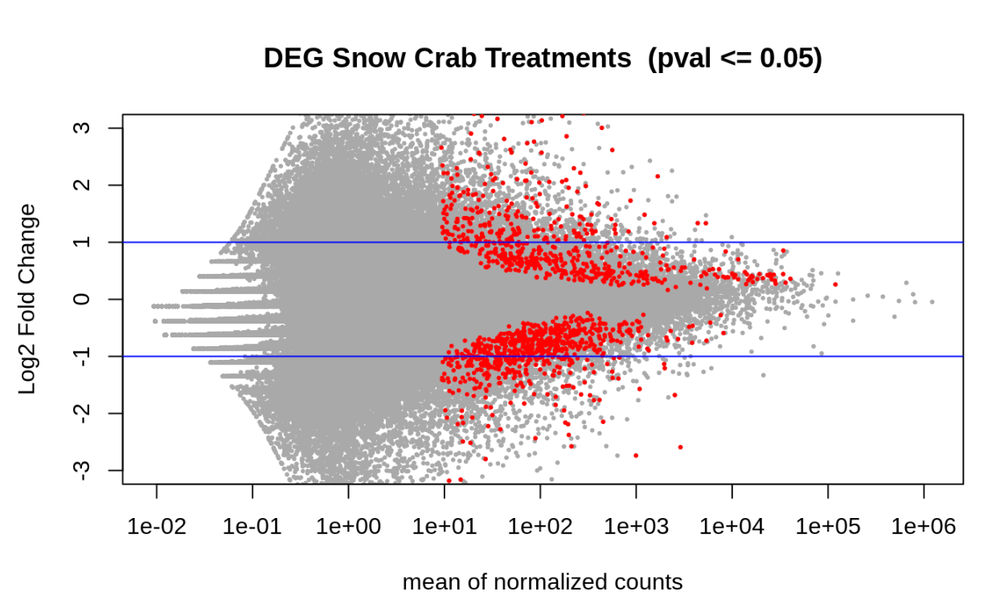

```{r setup, include=FALSE}
knitr::opts_chunk$set(echo = TRUE, eval = FALSE, warning = FALSE, message = FALSE)
```

# Introduction

[DOI](Courtney%20Skalley,%20&%20Steven%20Roberts.%20(2023).%20course-fish546-2023/courtney_RNAseq_crabs:%20v1.0-RNAseq_snowcrabs%20(v1.0-RNAseq_snowcrabs).%20Zenodo.%20https://doi.org/10.5281/zenodo.7972051) for github repository May 25, 2023

This project contains a workflow for examining the effect of ocean acidification on gene expression of snow crabs. It runs using paired end RNA-Seq data prepared and provided by Laura Spencer. 63 juvenile crabs were exposed to the following pH treatments:

-   control (ambient)
-   pH 7.8 (8 hours)
-   pH 7.8 (12 weeks)
-   pH 7.5 (8 hours)
-   pH 7.5 (12 weeks)

On 7/20/2021, after exposure, all crabs were sacrificed by puncturing the carapace through the cardiac region. Crabs were preserved overnight at 4C prior to being transferred to -80C. mRNA samples were then extracted. Each of the 63 mRNA samples were run in both lanes of NovaSeq 6000, for a grand total of 126 paired-end RNA-Seq data sets. Sequence data received January 3, 2022.



## Links:

-   [Rmd file](https://github.com/course-fish546-2023/courtney_RNAseq_crabs/blob/970eec8fea6298725a453ccc06ac890338e26598/code/snowcrabs_dge.Rmd)
-   [Output on github](https://github.com/course-fish546-2023/courtney_RNAseq_crabs/tree/main/output)
-   [DOI](Courtney%20Skalley,%20&%20Steven%20Roberts.%20(2023).%20course-fish546-2023/courtney_RNAseq_crabs:%20v1.0-RNAseq_snowcrabs%20(v1.0-RNAseq_snowcrabs).%20Zenodo.%20https://doi.org/10.5281/zenodo.7972051) for github repository May 25, 2023

## Data

The data is located [here](https://drive.google.com/drive/u/1/folders/1w7tqjcd-Rabh0TsWpw-JLTcJ2QbWIh3H), uploaded by LS on 01/12/2022.

Detailed metadata is located [here](https://docs.google.com/document/d/1HzMTreqnY2BD-oyjEJRA-JECpFE4CXlEoWKkmiaTYis/edit#).

# Code

## Look at all RNASeq files

There should be 63 samples, each with a forward and reverse sequence (designated by R1 and R2) for a total of 126 files.

```{bash}
ls /home/shared/8TB_HDD_01/snow_crab/5010
```

## Download C. opilio reference, save it to "data" directory

Here, we use curl to download an available C. opilio molting gland (mg) transcriptome and save it to our data directory.
```{bash}
cd ../data
curl -o "c_opilio_mg_transcriptome.fasta" -H "Accept: text/plain; format=tsv" "https://gannet.fish.washington.edu/seashell/snaps/HBXI01.fasta"
```

## Set index

We want to index "c_opilio_mg_transcriptome.fasta" and rename it as "c_opilio_mg_transcriptome.index" using kallisto.
```{bash}
/home/shared/kallisto/kallisto \
index -i \
../data/c_opilio_mg_transcriptome.index \
../data/c_opilio_mg_transcriptome.fasta
```

## Create abundance estimates

First, we want to make a new directory called "kallisto_mg" in our output folder. We then create a folder within "kallisto_mg" for each crab sample that will each hold the abundance estimates generated by kallisto. The name of each folder will match the basename of the original RNAseq file. This will generate 126 folders (two for each sample--both forward and reverse) so we will later have to remove one folder (will be empty) from each pair.

Then, we tell Kallisto which files we want it to quantify. Kallisto does a psuedo-alignment of each file using an index ("c_opilio_mg_transcriptome.index"), then quantifies the abundance of each contig. We will look for all fastq.gz files in the directory /5010 (our 126 RNA seq files), using wildcard (\*) to files with any base name.

We ask kallisto to generate abundance estimates using both forward and reverse reads and bundle them into a file that we already created and named accordingly.

Now, we can remove all folders in our "kallisto_mg" folder that are empty, which will be those ending in "R2_001.fastq.gz".
```{bash}
#make a new directory in output
mkdir ../output/kallisto_mg

#find specific files and create abundance estimates
find /home/shared/8TB_HDD_01/snow_crab/5010/*fastq.gz \
| xargs basename -s _L003_R1_001.fastq.gz | xargs -I{} \
/home/shared/kallisto/kallisto \
quant -i ../data/c_opilio_mg_transcriptome.index \
-o ../output/kallisto_mg/{} \
-t 40 \
/home/shared/8TB_HDD_01/snow_crab/5010/{}_L003_R1_001.fastq.gz \
/home/shared/8TB_HDD_01/snow_crab/5010/{}_L003_R2_001.fastq.gz

# delete empty files
rm -r ../output/kallisto_mg/*R2_001.fastq.gz/
```

## Create a gene expression matrix from kallisto output files

We first can list all folder names in our kallisto_mg file, then use this list in our next step.
```{bash}
ls ~/courtney_RNAseq_crabs/output/kallisto_mg
#use these folder names for perl input
```


Now, we use abundance_estimates_to_matrix.pl script from the Trinity RNA-seq assembly software package to create a matrix with all of the abundance.tsv files. This will generate a matrix called "kallisto_paired.isoform.counts.matrix" in our output folder.
```{bash}
#Sample name input for perl
perl /home/shared/trinityrnaseq-v2.12.0/util/abundance_estimates_to_matrix.pl \
--est_method kallisto \
    --gene_trans_map none \
    --out_prefix ../output/kallisto_mg \
    --name_sample_by_basedir \
    ../output/kallisto_mg/5010_1_S1/abundance.tsv \
    ../output/kallisto_mg/5010_2_S2/abundance.tsv \
    ../output/kallisto_mg/5010_3_S3/abundance.tsv \
    ../output/kallisto_mg/5010_4_S4/abundance.tsv \
    ../output/kallisto_mg/5010_5_S5/abundance.tsv \
    ../output/kallisto_mg/5010_6_S6/abundance.tsv \
    ../output/kallisto_mg/5010_7_S7/abundance.tsv \
    ../output/kallisto_mg/5010_8_S8/abundance.tsv \
    ../output/kallisto_mg/5010_9_S9/abundance.tsv \
    ../output/kallisto_mg/5010_10_S10/abundance.tsv \
    ../output/kallisto_mg/5010_11_S11/abundance.tsv \
    ../output/kallisto_mg/5010_12_S12/abundance.tsv \
    ../output/kallisto_mg/5010_13_S13/abundance.tsv \
    ../output/kallisto_mg/5010_14_S14/abundance.tsv \
    ../output/kallisto_mg/5010_15_S15/abundance.tsv \
    ../output/kallisto_mg/5010_16_S16/abundance.tsv \
    ../output/kallisto_mg/5010_17_S17/abundance.tsv \
    ../output/kallisto_mg/5010_18_S18/abundance.tsv \
    ../output/kallisto_mg/5010_19_S19/abundance.tsv \
    ../output/kallisto_mg/5010_20_S20/abundance.tsv \
    ../output/kallisto_mg/5010_21_S21/abundance.tsv \
    ../output/kallisto_mg/5010_22_S22/abundance.tsv \
    ../output/kallisto_mg/5010_23_S23/abundance.tsv \
    ../output/kallisto_mg/5010_24_S24/abundance.tsv \
    ../output/kallisto_mg/5010_25_S25/abundance.tsv \
    ../output/kallisto_mg/5010_26_S26/abundance.tsv \
    ../output/kallisto_mg/5010_27_S27/abundance.tsv \
    ../output/kallisto_mg/5010_28_S28/abundance.tsv \
    ../output/kallisto_mg/5010_29_S29/abundance.tsv \
    ../output/kallisto_mg/5010_30_S30/abundance.tsv \
    ../output/kallisto_mg/5010_31_S31/abundance.tsv \
    ../output/kallisto_mg/5010_32_S32/abundance.tsv \
    ../output/kallisto_mg/5010_33_S33/abundance.tsv \
    ../output/kallisto_mg/5010_34_S34/abundance.tsv \
    ../output/kallisto_mg/5010_35_S35/abundance.tsv \
    ../output/kallisto_mg/5010_36_S36/abundance.tsv \
    ../output/kallisto_mg/5010_37_S37/abundance.tsv \
    ../output/kallisto_mg/5010_38_S38/abundance.tsv \
    ../output/kallisto_mg/5010_39_S39/abundance.tsv \
    ../output/kallisto_mg/5010_40_S40/abundance.tsv \
    ../output/kallisto_mg/5010_41_S41/abundance.tsv \
    ../output/kallisto_mg/5010_42_S42/abundance.tsv \
    ../output/kallisto_mg/5010_43_S43/abundance.tsv \
    ../output/kallisto_mg/5010_44_S44/abundance.tsv \
    ../output/kallisto_mg/5010_45_S45/abundance.tsv \
    ../output/kallisto_mg/5010_46_S46/abundance.tsv \
    ../output/kallisto_mg/5010_47_S47/abundance.tsv \
    ../output/kallisto_mg/5010_48_S48/abundance.tsv \
    ../output/kallisto_mg/5010_49_S49/abundance.tsv \
    ../output/kallisto_mg/5010_50_S50/abundance.tsv \
    ../output/kallisto_mg/5010_51_S51/abundance.tsv \
    ../output/kallisto_mg/5010_52_S52/abundance.tsv \
    ../output/kallisto_mg/5010_53_S53/abundance.tsv \
    ../output/kallisto_mg/5010_54_S54/abundance.tsv \
    ../output/kallisto_mg/5010_55_S55/abundance.tsv \
    ../output/kallisto_mg/5010_56_S56/abundance.tsv \
    ../output/kallisto_mg/5010_57_S57/abundance.tsv \
    ../output/kallisto_mg/5010_58_S58/abundance.tsv \
    ../output/kallisto_mg/5010_59_S59/abundance.tsv \
    ../output/kallisto_mg/5010_60_S60/abundance.tsv \
    ../output/kallisto_mg/5010_61_S61/abundance.tsv \
    ../output/kallisto_mg/5010_62_S62/abundance.tsv \
    ../output/kallisto_mg/5010_63_S63/abundance.tsv

```

## Get packages

Download these packages to generate figures and differential gene expression.
```{r, eval = TRUE, echo = FALSE}
library(DESeq2)
library(tidyverse)
library(pheatmap)
library(RColorBrewer)
library(data.table)
```

## Read in count matrix

Save our count matrix from its location into a local object in R. Label the rows and columns of the matrix.
```{r, , eval = TRUE}
countmatrix <- read.delim("../output/kallisto_mg.isoform.counts.matrix", header = TRUE, sep = '\t')
rownames(countmatrix) <- countmatrix$X
countmatrix <- countmatrix[,-1]
head(countmatrix)
```

### Round up to whole numbers

```{r, eval = TRUE, echo = FALSE}
countmatrix <- round(countmatrix, 0)
str(countmatrix)
```

## Get differential gene expression based on pH exposure

Use DESeq2 to see differential gene expression. Looking at metadata, we can see that the first 12 samples were the "control", followed by 14 "pH 7.5-long exposure", 12 "pH 7.5-short exposure", 14 "pH 7.8-long exposure", then 11 "pH 7.8-short exposure". This gives us a total of 63 "paired-end" reads. This information can be used to label the matrix accordingly.
```{r, , eval = TRUE, echo = FALSE}
deseq2.colData <- data.frame(condition=factor(c(rep("control", 12), rep("pH 7.5-long exposure", 14), rep("pH 7.5-short exposure", 12), rep("pH 7.8-long exposure", 14), rep("pH 7.8-short exposure", 11))), type=factor(rep("paired-end", 63)))
rownames(deseq2.colData) <- colnames(data)
deseq2.dds <- DESeqDataSetFromMatrix(countData = countmatrix,
                                     colData = deseq2.colData, 
                                     design = ~ condition)
dim(countmatrix)
dim(deseq2.colData)
deseq2.colData
deseq2.dds
```

Here, we save the results to local object "deseq2.dds" so that we can create plots in R.
```{r, eval = TRUE, echo = FALSE, warning = FALSE}
deseq2.dds <- DESeq(deseq2.dds)
deseq2.res <- results(deseq2.dds)
deseq2.res <- deseq2.res[order(rownames(deseq2.res)), ]
```

## Look at DESeq matrix

Look at deseq2.res to make sure that nothing looks off. Should be a data frame with 6 rows and 6 columns.
```{r, eval = TRUE}
head(deseq2.res)
```

## Look for signficant values

Count the number of hits with adjusted p-value less then 0.05
```{r, eval = TRUE}
dim(deseq2.res[!is.na(deseq2.res$padj) & deseq2.res$padj <= 0.05, ])
```

Create a volcano plot that shows the log change of gene expression between the different pH treatments.
```{r, eval = TRUE}
tmp <- deseq2.res
# The main plot
plot(tmp$baseMean, tmp$log2FoldChange, pch=20, cex=0.45, ylim=c(-3, 3), log="x", col="darkgray",
     main="DEG Snow Crab Treatments  (pval <= 0.05)",
     xlab="mean of normalized counts",
     ylab="Log2 Fold Change")
# Getting the significant points and plotting them again so they're a different color
tmp.sig <- deseq2.res[!is.na(deseq2.res$padj) & deseq2.res$padj <= 0.05, ]
points(tmp.sig$baseMean, tmp.sig$log2FoldChange, pch=20, cex=0.45, col="red")
# 2 FC lines
abline(h=c(-1,1), col="blue")
```

```{r, eval = TRUE, echo = TRUE}
write.table(tmp.sig, "../output/DEGlist.tab", row.names = T)
```
