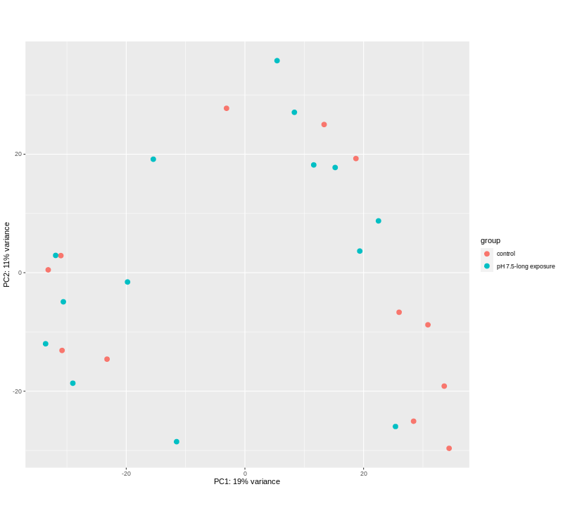

```{r setup, include=FALSE}
knitr::opts_chunk$set(
  echo = TRUE,          # Display code chunks
  eval = FALSE,         # Evaluate code chunks
  warning = FALSE,      # Hide warnings
  message = FALSE,      # Hide messages
  fig.align = "center") # Align plots to the center
```

# Introduction

[DOI](Courtney%20Skalley,%20&%20Steven%20Roberts.%20(2023).%20course-fish546-2023/courtney_RNAseq_crabs:%20v1.0-RNAseq_snowcrabs%20(v1.0-RNAseq_snowcrabs).%20Zenodo.%20https://doi.org/10.5281/zenodo.7972051) for github repository May 25, 2023

This project contains a workflow for examining the effect of ocean acidification on gene expression of snow crabs. It runs using paired end RNA-Seq data prepared and provided by Laura Spencer. 63 juvenile crabs were exposed to the following pH treatments:

-   control (ambient)
-   pH 7.8 (8 hours)
-   pH 7.8 (12 weeks)
-   pH 7.5 (8 hours)
-   pH 7.5 (12 weeks)

On 7/20/2021, after exposure, all crabs were sacrificed by puncturing the carapace through the cardiac region. Crabs were preserved overnight at 4C prior to being transferred to -80C. mRNA samples were then extracted. Each of the 63 mRNA samples were run in both lanes of NovaSeq 6000, for a grand total of 126 paired-end RNA-Seq data sets. Sequence data received January 3, 2022.


## Links

-   [Rmd file](https://github.com/course-fish546-2023/courtney_RNAseq_crabs/blob/970eec8fea6298725a453ccc06ac890338e26598/code/snowcrabs_dge.Rmd)
-   [Output on github](https://github.com/course-fish546-2023/courtney_RNAseq_crabs/tree/main/output)
-   [DOI](Courtney%20Skalley,%20&%20Steven%20Roberts.%20(2023).%20course-fish546-2023/courtney_RNAseq_crabs:%20v1.0-RNAseq_snowcrabs%20(v1.0-RNAseq_snowcrabs).%20Zenodo.%20https://doi.org/10.5281/zenodo.7972051) for github repository May 25, 2023

## Data

The data is located [here](https://drive.google.com/drive/u/1/folders/1w7tqjcd-Rabh0TsWpw-JLTcJ2QbWIh3H), uploaded by LS on 01/12/2022.

Detailed metadata is located [here](https://docs.google.com/document/d/1HzMTreqnY2BD-oyjEJRA-JECpFE4CXlEoWKkmiaTYis/edit#).

# Setup

## Get packages

Download these packages for analysis and figure generation.

```{r, eval = TRUE, echo = TRUE}
library(DESeq2)
library(tidyverse)
library(pheatmap)
library(RColorBrewer)
library(data.table)
library(gplots)
library(knitr)
```

Check that blast software has been downloaded

```{bash}
ls /home/shared/
```

## Access RNASeq data

There should be 63 samples, each with a forward and reverse sequence (designated by R1 and R2) for a total of 126 files.

```{bash}
ls /home/shared/8TB_HDD_01/snow_crab/5010
```

## Download transcriptome

There are three available transcriptomes for opilio crabs: molting gland, eyestalk ganglia, and hepatopancreas. Here, we will be using the molting gland transcriptome.

```{bash}
cd ../data
curl -o "c_opilio_mg_transcriptome.fasta" -H "Accept: text/plain; format=tsv" "https://gannet.fish.washington.edu/seashell/snaps/HBXI01.fasta"
```

Examine the molting gland (mg) transcriptome:

```{bash, eval=TRUE}
head ../data/c_opilio_mg_transcriptome.fasta
echo "How many sequences are there?"
grep -c ">" ../data/c_opilio_mg_transcriptome.fasta
```

# Blast

## UniProt/Swiss-Prot data

Download UniProt/Swiss-prot fasta, rename with year and version, then unzip the file.

```{bash, blast database}
cd ../data
curl -O https://ftp.uniprot.org/pub/databases/uniprot/current_release/knowledgebase/complete/uniprot_sprot.fasta.gz
mv uniprot_sprot.fasta.gz uniprot_sprot_r2023_01.fasta.gz
gunzip -k uniprot_sprot_r2023_01.fasta.gz
ls ../data
```

Make blast database, save the Uniprot/Swiss-Prot data there.

```{bash}
/home/shared/ncbi-blast-2.11.0+/bin/makeblastdb \
-in ../data/uniprot_sprot_r2023_01.fasta \
-dbtype prot \
-out ../blastdb/uniprot_sprot_r2023_01
```

## Run blast

Blast the *opilio* molting gland transcriptome

```{bash}
/home/shared/ncbi-blast-2.11.0+/bin/blastx \
-query ../data/c_opilio_mg_transcriptome.fasta \
-db ../blastdb/uniprot_sprot_r2023_01 \
-out ../output/c_opilio_mg_uniprot_blastx.tab \
-evalue 1E-20 \
-num_threads 20 \
-max_target_seqs 1 \
-outfmt 6
```

Examine blastx table

```{bash, eval=TRUE}
head -2 ../output/c_opilio_mg_uniprot_blastx.tab
wc -l ../output/c_opilio_mg_uniprot_blastx.tab
```

## Uniprot table

Download UniProt table into data directory, rename as "uniprot_table_r2023_01.tab"

```{bash}
cd ../data
curl -o "uniprot_table_r2023_01.tab" -H "Accept: text/plain; format=tsv" "https://gannet.fish.washington.edu/seashell/snaps/uniprot_table_r2023_01.tab"
```

Examine UniProt table

```{bash, eval=TRUE}
head -2 ../data/uniprot_table_r2023_01.tab
```

Save annotated *opilio* transcriptome as local objects for later use.

```{r, eval = TRUE}
annot_tab <- read.csv("../output/blast_annot_go_mg.tab", sep = '\t', header = TRUE)
```

# Differential Gene Expression Analysis

## Set index

We want to index "c_opilio_mg_transcriptome.fasta" and rename it as "c_opilio_mg_transcriptome.index" using kallisto.

```{bash}
/home/shared/kallisto/kallisto \
index -i \
../data/c_opilio_mg_transcriptome.index \
../data/c_opilio_mg_transcriptome.fasta
```

## Abundance estimates

First, we want to make a new directory called "kallisto_mg" in our output folder. We then create a folder within "kallisto_mg" for each crab sample that will each hold the abundance estimates generated by kallisto. The name of each folder will match the basename of the original RNAseq file. This will generate 126 folders (two for each sample--both forward and reverse) so we will later have to remove one folder (will be empty) from each pair.

Then, we tell Kallisto which files to quantify. Kallisto does a psuedo-alignment of each file using an index ("c_opilio_mg_transcriptome.index"), then quantifies the abundance of each contig. We will look for all fastq.gz files in the directory "/5010" (our 126 RNA seq files), using wildcard (\*) to find files with **any** base name.

We ask kallisto to generate abundance estimates using both forward and reverse reads, bundle them into a file, and save them into a directory that we already created and named accordingly.

Now, we can remove all folders in our "kallisto_mg" folder that are empty, which will be those ending in "R2_001.fastq.gz".

```{bash}
#make a new directory in output
mkdir ../output/kallisto_mg

#find specific files and create abundance estimates
find /home/shared/8TB_HDD_01/snow_crab/5010/*fastq.gz \
| xargs basename -s _L003_R1_001.fastq.gz | xargs -I{} \
/home/shared/kallisto/kallisto \
quant -i ../data/c_opilio_mg_transcriptome.index \
-o ../output/kallisto_mg/{} \
-t 40 \
/home/shared/8TB_HDD_01/snow_crab/5010/{}_L003_R1_001.fastq.gz \
/home/shared/8TB_HDD_01/snow_crab/5010/{}_L003_R2_001.fastq.gz

# delete empty files
rm -r ../output/kallisto_mg/*R2_001.fastq.gz/
```

## Gene expression matrix

First, we can list all folder names in our kallisto_mg file, then use this list in our next step.

```{bash}
ls ~/courtney_RNAseq_crabs/output/kallisto_mg
#use these folder names for perl input
```

Now, we use abundance_estimates_to_matrix.pl script from the Trinity RNA-seq assembly software package to create a matrix with all of the abundance.tsv files. This will generate a matrix called "kallisto_paired.isoform.counts.matrix" in our output folder.

```{bash}
#Sample name input for perl
perl /home/shared/trinityrnaseq-v2.12.0/util/abundance_estimates_to_matrix.pl \
--est_method kallisto \
    --gene_trans_map none \
    --out_prefix ../output/kallisto_mg \
    --name_sample_by_basedir \
    ../output/kallisto_mg/5010_1_S1/abundance.tsv \
    ../output/kallisto_mg/5010_2_S2/abundance.tsv \
    ../output/kallisto_mg/5010_3_S3/abundance.tsv \
    ../output/kallisto_mg/5010_4_S4/abundance.tsv \
    ../output/kallisto_mg/5010_5_S5/abundance.tsv \
    ../output/kallisto_mg/5010_6_S6/abundance.tsv \
    ../output/kallisto_mg/5010_7_S7/abundance.tsv \
    ../output/kallisto_mg/5010_8_S8/abundance.tsv \
    ../output/kallisto_mg/5010_9_S9/abundance.tsv \
    ../output/kallisto_mg/5010_10_S10/abundance.tsv \
    ../output/kallisto_mg/5010_11_S11/abundance.tsv \
    ../output/kallisto_mg/5010_12_S12/abundance.tsv \
    ../output/kallisto_mg/5010_13_S13/abundance.tsv \
    ../output/kallisto_mg/5010_14_S14/abundance.tsv \
    ../output/kallisto_mg/5010_15_S15/abundance.tsv \
    ../output/kallisto_mg/5010_16_S16/abundance.tsv \
    ../output/kallisto_mg/5010_17_S17/abundance.tsv \
    ../output/kallisto_mg/5010_18_S18/abundance.tsv \
    ../output/kallisto_mg/5010_19_S19/abundance.tsv \
    ../output/kallisto_mg/5010_20_S20/abundance.tsv \
    ../output/kallisto_mg/5010_21_S21/abundance.tsv \
    ../output/kallisto_mg/5010_22_S22/abundance.tsv \
    ../output/kallisto_mg/5010_23_S23/abundance.tsv \
    ../output/kallisto_mg/5010_24_S24/abundance.tsv \
    ../output/kallisto_mg/5010_25_S25/abundance.tsv \
    ../output/kallisto_mg/5010_26_S26/abundance.tsv \
    ../output/kallisto_mg/5010_27_S27/abundance.tsv \
    ../output/kallisto_mg/5010_28_S28/abundance.tsv \
    ../output/kallisto_mg/5010_29_S29/abundance.tsv \
    ../output/kallisto_mg/5010_30_S30/abundance.tsv \
    ../output/kallisto_mg/5010_31_S31/abundance.tsv \
    ../output/kallisto_mg/5010_32_S32/abundance.tsv \
    ../output/kallisto_mg/5010_33_S33/abundance.tsv \
    ../output/kallisto_mg/5010_34_S34/abundance.tsv \
    ../output/kallisto_mg/5010_35_S35/abundance.tsv \
    ../output/kallisto_mg/5010_36_S36/abundance.tsv \
    ../output/kallisto_mg/5010_37_S37/abundance.tsv \
    ../output/kallisto_mg/5010_38_S38/abundance.tsv \
    ../output/kallisto_mg/5010_39_S39/abundance.tsv \
    ../output/kallisto_mg/5010_40_S40/abundance.tsv \
    ../output/kallisto_mg/5010_41_S41/abundance.tsv \
    ../output/kallisto_mg/5010_42_S42/abundance.tsv \
    ../output/kallisto_mg/5010_43_S43/abundance.tsv \
    ../output/kallisto_mg/5010_44_S44/abundance.tsv \
    ../output/kallisto_mg/5010_45_S45/abundance.tsv \
    ../output/kallisto_mg/5010_46_S46/abundance.tsv \
    ../output/kallisto_mg/5010_47_S47/abundance.tsv \
    ../output/kallisto_mg/5010_48_S48/abundance.tsv \
    ../output/kallisto_mg/5010_49_S49/abundance.tsv \
    ../output/kallisto_mg/5010_50_S50/abundance.tsv \
    ../output/kallisto_mg/5010_51_S51/abundance.tsv \
    ../output/kallisto_mg/5010_52_S52/abundance.tsv \
    ../output/kallisto_mg/5010_53_S53/abundance.tsv \
    ../output/kallisto_mg/5010_54_S54/abundance.tsv \
    ../output/kallisto_mg/5010_55_S55/abundance.tsv \
    ../output/kallisto_mg/5010_56_S56/abundance.tsv \
    ../output/kallisto_mg/5010_57_S57/abundance.tsv \
    ../output/kallisto_mg/5010_58_S58/abundance.tsv \
    ../output/kallisto_mg/5010_59_S59/abundance.tsv \
    ../output/kallisto_mg/5010_60_S60/abundance.tsv \
    ../output/kallisto_mg/5010_61_S61/abundance.tsv \
    ../output/kallisto_mg/5010_62_S62/abundance.tsv \
    ../output/kallisto_mg/5010_63_S63/abundance.tsv

```

## Count matrix

Save our count matrix from its location into a local object in R. Label the rows and columns of the matrix. Looking at metadata, we can see that the first 12 samples were the "control", followed by 14 "pH 7.5-long exposure", 12 "pH 7.5-short exposure", 14 "pH 7.8-long exposure", then 11 "pH 7.8-short exposure". This gives us a total of 63 paired-end reads. This information can be used to label the matrix accordingly.

Here, we select columns 2:27 which contain the control and pH 7.5 long exposure sequences. Locations of other pH treatments:

-   For control: countmatrix[,2:13]
-   For pH 7.5 long exposure: countmatrix[,14:27]
-   For pH 7.5 short exposure: countmatrix[,28:39]
-   For pH 7.8 long exposure: countmatrix[,40:53]
-   For pH 7.8 short exposure: countmatrix[,54:64]

```{r, eval = TRUE}
countmatrix <- read.delim("../output/kallisto_mg.isoform.counts.matrix", header = TRUE, sep = '\t')
rownames(countmatrix) <- countmatrix$X
countmatrix_pH7.5_long <- countmatrix[,2:27] #select only the control and pH 7.5 (long exposure)
head(countmatrix_pH7.5_long, 2)
```

### Clean up the matrix

Round up to whole numbers.

```{r, eval = TRUE, echo = FALSE, cache=TRUE}
countmatrix_pH7.5_long <- round(countmatrix_pH7.5_long, 0)
```

## DESeq2

Use DESeq2 to see differential gene expression based on pH exposure.

```{r, , eval = TRUE, cache = TRUE}
deseq2.colData <- data.frame(condition=factor(c(rep("control", 12), rep("pH 7.5-long exposure", 14))))
rownames(deseq2.colData) <- colnames(data)
deseq2.dds <- DESeqDataSetFromMatrix(countData = countmatrix_pH7.5_long,
                                     colData = deseq2.colData, 
                                     design = ~ condition)
dim(countmatrix_pH7.5_long)
dim(deseq2.colData)
```

Here, we save the results to local object "deseq2.dds" so that we can create plots in R.

```{r, eval = TRUE, warning = FALSE}
deseq2.dds <- DESeq(deseq2.dds)
deseq2.res <- results(deseq2.dds) #save results of DESeq as a new variable 
deseq2.res <- deseq2.res[order(rownames(deseq2.res)), ]
```

Look at deseq2.res to make sure that everything looks good.

```{r, eval = TRUE}
head(deseq2.res)
```

## Signficant values

Count the number of hits with adjusted p-value less then 0.05

```{r, eval = TRUE}
dim(deseq2.res[!is.na(deseq2.res$padj) & deseq2.res$padj <= 0.05, ])
```

Save significant DESeq analysis results as local object for later use in figures and create a table in "output".

```{r, eval = TRUE, echo = TRUE, cache=TRUE}
deseq2.res.sig <- deseq2.res[!is.na(deseq2.res$padj) & deseq2.res$padj <= 0.05, ]
write.table(deseq2.res.sig, "../output/DEGlist.tab", row.names = T)
```

# DGE Table Annotation

## Format tables correctly

Here, we make sure that the columns of DEGlist.tab are formatted in a way that is compatible with the columns of annot_tab. We need to separate "ENA\|HBXI01000282\|HBXI01000282.1" into individual elements "ENA," "HBXI01000282," and "HBXI01000282.1" by replacing pipes with tabs.

```{bash}
cat ../output/DEGlist.tab | tr '|' '\t' |  tr -d \" | sed '1d' \
> ../output/DEGlist_sep.tab  #rename with "_sep"
```

Compare the original table to separated table to make sure that columns were correctly separated.

```{bash, eval = TRUE}
head -2 ../output/DEGlist.tab
```

```{bash, eval = TRUE}
head -2 ../output/DEGlist_sep.tab
```

Read the separated DEG table as a local variable "DEGtab" so that we can use it in "left_join" in the next step.

```{r, eval = TRUE}
DEGtab <- read.csv("../output/DEGlist_sep.tab", sep = "", header = FALSE)
# head(DEGtab)
```

Join the DEG table and the annotated table where the columns match. Here, V3 in DEGtab matches V3 in annot_tab. We write the output into a file in the "output" directory.

```{r, eval = TRUE}
DEG_annot_tab <- left_join(DEGtab, annot_tab, by = c("V3" = "V3")) %>%
  write_delim("../output/DEG_annot.tab", delim = '\t')
```

```{r, eval = TRUE}
# look at annotated table of differentially expressed genes
head(DEG_annot_tab, 2)
```

# Data Visualization

### Data wrangling

Take counts from deseq2.dds, save as local object and as file.

```{r, eval = TRUE}
#extract counts and normalizes them 
counts <- counts(deseq2.dds, normalized = TRUE)

#save counts as file for use in bash manipulation
write.table(counts, file = "../output/DESeq_counts.tab", sep = "\t", quote = TRUE, row.names = TRUE)
```

```{r}
head(counts) 
#we can see that the rows are combined "ENA|HBXI01058009|HBXI01058009.1" 
# they need to be separated for future steps
```

Here, we format DESeq_counts.tab are in a way that can be used in heatmaps. We need to separate "ENA\|HBXI01000282\|HBXI01000282.1" into individual elements "ENA," "HBXI01000282," and "HBXI01000282.1" by replacing pipes with tabs.

```{bash}
cat ../output/DESeq_counts.tab | tr '|' '\t' |  tr -d \" | sed '1d' \
> ../output/DESeq_counts_sep.tab  # rename with "_sep"

# examine new table
head -1 ../output/DESeq_counts_sep.tab
```

```{bash}
# compare to old table
head -2 ../output/DESeq_counts.tab
```

Clean up counts_sep and annot_tab with appropriate names and column organization.

```{r, eval = TRUE}
#read in separeted DESeq_counts_sep.tab as local variable
counts_sep <- read.csv("../output/DESeq_counts_sep.tab", sep = '\t', header = FALSE)

#rename columns
colnames(counts_sep) <- c(1,"access_num",
                          "access_num_ver",
                          paste0("S", 1:12, " (control)"), 
                          paste0("S", 13:26, " (pH 7.5-long)"))

#reorder columns so that accession numbers are first
counts_sep <- counts_sep[ , c(3,2,1,4:29)]

#read in annot_tab (created earlier for blast)
annot_tab <- read.csv("../output/blast_annot_go_mg.tab", sep = '\t', header = TRUE)

#rename columns to match counts_sep
colnames(annot_tab)[2] <- "access_num"
colnames(annot_tab)[3] <- "access_num_ver"

#reorder columns so that accession numbers are first
annot_tab <- annot_tab[,c(3,2,1,4:32)]
```

```{r, eval=TRUE}
head(annot_tab,1)
```

Merge the blast table and counts table together.

```{r, eval = TRUE}
#both must be data frames
counts_merged <- merge(counts_sep, annot_tab, by = "access_num_ver", all=FALSE) 

# head(counts_merged)

#check to see if there any duplicates
head(which(duplicated(counts_merged))) 
```

Convert counts_merged into a matrix and rename rows.

```{r, eval = TRUE}
#make this a matrix so it can take the rownames()
counts_merged.mat <- as.matrix(counts_merged)

#make a vector of names from the first column (access_num_ver)
access_num_ver <- counts_merged.mat[,1]

#rename all rows with access_num_ver
rownames(counts_merged.mat) <- access_num_ver 
```

Pick the top 1000 differentially expressed genes and find where those intersect with the abundance counts matrix (counts_merged.mat). Because each element in top_genes is also connected by pipes, we need to separate them into columns then select which columns contain the correct data.

```{r, eval = TRUE}
#designate top 1000 genes
res_ordered <- deseq2.res[order(deseq2.res$padj), ]
top_genes <- row.names(res_ordered)[1:1000]


# Fixing top_genes to be in the correct format for interesect()
# Input string
input_vector <- top_genes

# Separate the vector into separate columns using the pipe symbol as the delimiter
split_columns <- do.call(rbind, strsplit(input_vector, "\\|"))

# Separate by column 3, which matches "access_num_ver" in annot_tab and counts_sep
top_genes.sep <- split_columns[1:length(top_genes),3]


# Identify top genes that are present in the counts_merged.mat row names
present_genes <- intersect(top_genes.sep, row.names(counts_merged.mat))

# Extract the rows corresponding to the present genes
counts_top <- counts_merged.mat[present_genes, ]
head(counts_top, 1)

#check how many DEGs will be plotted
nrow(counts_top) #43
```

#### Clean up the data frame

Organizing by protein name

```{r, eval = TRUE}
#trim down data frame 
counts_top_pro <- counts_top[, c(1,4:29,47)] #protein names are in column 47

#rename rows as protein names
rownames(counts_top_pro) <- counts_top_pro[,"Protein.names"]

#remove protein column
counts_top_pro <- counts_top_pro[ ,-47]
counts_top_pro <- as.matrix(counts_top_pro)

# head(counts_top_pro)
```

```{r, eval = TRUE}
#convert the counts into numbers from character into new matrix and renaming the col and row names of that new matrix
counts_top_pro2 <- matrix(as.numeric(counts_top_pro),
                          ncol = ncol(counts_top_pro))
colnames(counts_top_pro2) <- colnames(counts_top_pro)
protein_names <- rownames(counts_top_pro)

#clean up protein names list so that each entry is not as long 
protein_names2 <- protein_names %>%
  sub(' \\([^)]+\\).*$', '', .) %>%
  sub('\\[.*?\\]', ' ', .)

rownames(counts_top_pro2) <- protein_names2
```

```{r, eval = TRUE}
# Perform log transformation
log_counts_top2 <- log2(counts_top_pro2 + 1)
```

Organizing by "Gene.Ontology..biological.process."

```{r}
#trim down data frame
counts_top_bio_ont <- counts_top[, c(1,4:29,53)]

#rename rows as biological process
rownames(counts_top_bio_ont) <- counts_top_bio_ont[,"Gene.Ontology..biological.process."]

#delete Gene.Ontology..biological.process. column
counts_top_bio_ont <- counts_top_bio_ont[ ,-53]
counts_top_bio_ont <- as.matrix(counts_top_bio_ont)

head(counts_top_bio_ont)
```

```{r}
#convert the counts into numbers from characters 
#into new matrix and renaming the col and row names of that new matrix
counts_top_bio_ont2 <- matrix(as.numeric(counts_top_bio_ont),
                          ncol = ncol(counts_top_bio_ont))
colnames(counts_top_bio_ont2) <- colnames(counts_top_bio_ont)
bio_ont <- rownames(counts_top_bio_ont)

head(bio_ont)
#need to find a way to clean up biological process list so that each entry is not as long 

rownames(counts_top_bio_ont2) <- bio_ont2
```

```{r}
# Perform log transformation
log_counts_top_bio2 <- log2(counts_top_bio_ont2 + 1)
```

## Heatmap (Labeled)

```{r, eval = TRUE, , warning = FALSE}
# Define custom palette of shades of light orange to dark orange
custom_palette <- c('#fff7fb','#ece2f0','#d0d1e6',
                    '#a6bddb','#67a9cf','#3690c0',
                    '#02818a','#016c59','#014636')


par(mar=c(7,4,4,2)+0.1) 
png(filename='../output/03-heatmap-01.png', width=800, height=750)

# Customize the heatmap using heatmap.2
heatmap.2(log_counts_top2,
          scale="column",
          cexRow=0.9,
          margins =c(10,20),
          col=custom_palette,
          Colv = FALSE,
          ylab = "Protein Names",    
          xlab = "Sample Run ID",
          key=TRUE,
          keysize = 0.7,
          key.title = "Log Counts",
          key.xlab = "Expression",
          key.ylab = "Frequency",
          trace="none",
          cexCol = 1) 

graphics.off()
```


## Volcano Plot

This generates a volcano plot that shows the log change of gene expression between the control and a treatment of pH 7.5 for 12 weeks.

```{r, eval = TRUE, echo = TRUE}

par(mar=c(7,4,4,2)+0.1) 
png(filename='../output/03-volcano-plot.png', width=800, height=750)

# The main plot
plot(deseq2.res$baseMean, deseq2.res$log2FoldChange, pch=20, cex=0.45, ylim=c(-3, 3), log="x", col="darkgray",
     main="DEG Snow Crab Treatments  (pval <= 0.05)",
     xlab="mean of normalized counts",
     ylab="Log2 Fold Change")
# Getting the significant points and plotting them again so they're a different color
points(deseq2.res.sig$baseMean, deseq2.res.sig$log2FoldChange, pch=20, cex=0.7, col="#3690c0")
# 2 FC lines
abline(h=c(-1,1), col="#ec7014")

graphics.off()
```


## Principal Component Analysis

```{r, eval = TRUE}
par(mar=c(7,4,4,2)+0.1) 
png(filename='../output/03-PCA.png', width=800, height=750)

vst.data <- vst(deseq2.dds, blind = FALSE)
plotPCA(vst.data, intgroup = "condition")

graphics.off()
```



### Data wrangling for heatmap

```{r, eval = TRUE, echo = FALSE}
#Trying to add labels. Select the top 50 genes
res_ordered <- deseq2.res[order(deseq2.res$padj), ]
top_genes <- row.names(res_ordered)[1:50]

#extract counts 
counts <- counts(deseq2.dds, normalized =TRUE)
counts_top <- counts[top_genes, ]
log_counts_top <- log2(counts_top + 1)

#Write log_counts_top into a file so that it can be manipulated in bash 
write.table(log_counts_top, file = "../output/log_counts_top.tab", sep = "\t", quote = TRUE, row.names = TRUE)
```

Separate out pipes into tabs.

```{bash}
cat ../output/log_counts_top.tab | tr '|' '\t' |  tr -d \" | sed '1d' \
> ../output/log_counts_top_sep.tab  # rename with "_sep"

# examine new table
head -1 ../output/log_counts_top_sep.tab
```

Clean up counts_sep and annot_tab with appropriate names and column organization.

```{r, eval = TRUE}
# read in separeted log_counts_top_sep.tab as local variable
log_counts_top_sep <- read.csv("../output/log_counts_top_sep.tab", sep = '\t', header = FALSE)
head(log_counts_top_sep)

# rename columns
colnames(log_counts_top_sep) <- c(1,"access_num",
                          "access_num_ver",
                          paste0("S", 1:12, " (control)"), 
                          paste0("S", 13:26, " (pH 7.5-long)"))

# make a vector of names from the first column (access_num_ver)
access_num_ver <- log_counts_top_sep[,3]

#rename all rows with access_num_ver
rownames(log_counts_top_sep) <- access_num_ver 

# removes ENA and accession numbers
log_counts_top_sep <- log_counts_top_sep[,c(4:29)]

#converts to matrix for use in heatmap()
log_counts_top_sep <- as.matrix(log_counts_top_sep)
```

## Heatmap

```{r, eval = TRUE, warning = FALSE}

png(file="../output/03-heatmap-02.png",
width=900, height=650)
pheatmap(log_counts_top_sep, 
         scale = "row", 
         color = custom_palette,
         fontsize_row = 8,
         cellheight = 8)
dev.off()
```


