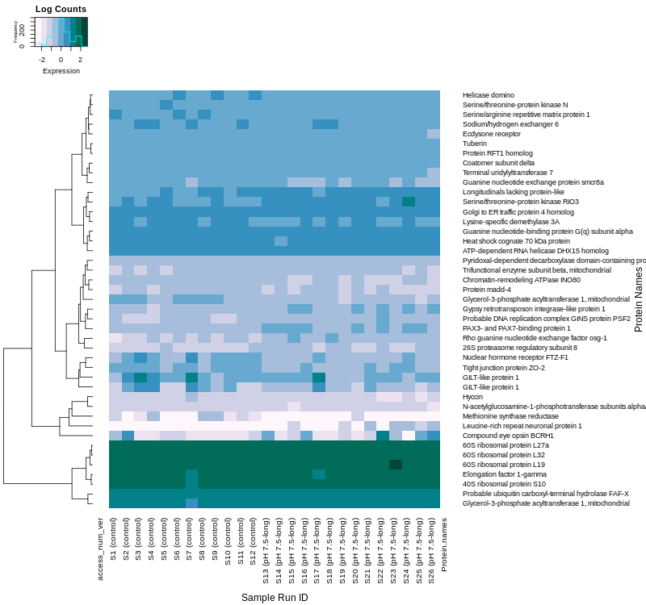
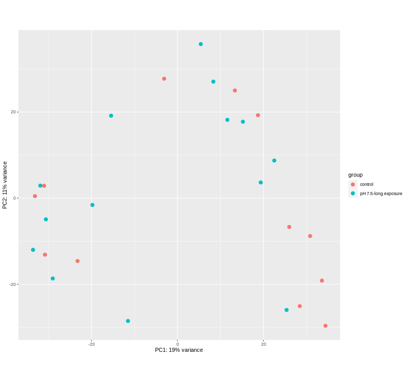
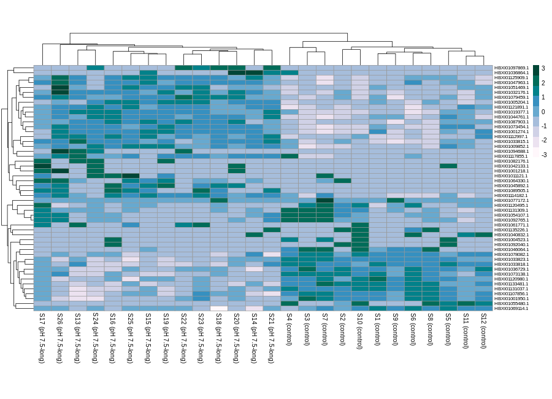

```{r setup, include=FALSE}
knitr::opts_chunk$set(echo = TRUE, eval = TRUE)
```

```{r, eval = TRUE, echo = TRUE, warnings = FALSE}
library(tidyverse)
library(DESeq2)
library(pheatmap)
library(RColorBrewer)
library(data.table)
library(gplots)
library(knitr)
```

# Data Visualization

### Data wrangling

Run DESeq2 so that we have all the necessary files.

```{r, eval = TRUE}
countmatrix <- read.delim("../output/kallisto_mg.isoform.counts.matrix", header = TRUE, sep = '\t')
rownames(countmatrix) <- countmatrix$X
countmatrix_pH7.5_long <- countmatrix[,2:27] #select only the control and pH 7.5 (long exposure)
head(countmatrix_pH7.5_long, 2)
```
Round up to whole numbers.

```{r, eval = TRUE, echo = FALSE, cache=TRUE}
countmatrix_pH7.5_long <- round(countmatrix_pH7.5_long, 0)
```


```{r, , eval = TRUE, cache = TRUE, warnings = FALSE}
deseq2.colData <- data.frame(condition=factor(c(rep("control", 12), rep("pH 7.5-long exposure", 14))))
rownames(deseq2.colData) <- colnames(data)
deseq2.dds <- DESeqDataSetFromMatrix(countData = countmatrix_pH7.5_long,
                                     colData = deseq2.colData, 
                                     design = ~ condition)
dim(countmatrix_pH7.5_long)
dim(deseq2.colData)
```

Take counts from deseq2.dds, save as local object and as file.

```{r, eval = TRUE}
#extract counts and normalizes them 
counts <- counts(deseq2.dds, normalized = TRUE)

#save counts as file for use in bash manipulation
write.table(counts, file = "../output/DESeq_counts.tab", sep = "\t", quote = TRUE, row.names = TRUE)
```

```{r}
head(counts) 
#we can see that the rows are combined "ENA|HBXI01058009|HBXI01058009.1" 
# they need to be separated for future steps
```

Here, we format DESeq_counts.tab are in a way that can be used in heatmaps. We need to separate "ENA\|HBXI01000282\|HBXI01000282.1" into individual elements "ENA," "HBXI01000282," and "HBXI01000282.1" by replacing pipes with tabs.

```{bash}
cat ../output/DESeq_counts.tab | tr '|' '\t' |  tr -d \" | sed '1d' \
> ../output/DESeq_counts_sep.tab  # rename with "_sep"

# examine new table
head -1 ../output/DESeq_counts_sep.tab
```

```{bash}
# compare to old table
head -2 ../output/DESeq_counts.tab
```

Clean up counts_sep and annot_tab with appropriate names and column organization.

```{r, eval = TRUE}
#read in separeted DESeq_counts_sep.tab as local variable
counts_sep <- read.csv("../output/DESeq_counts_sep.tab", sep = '\t', header = FALSE)

#rename columns
colnames(counts_sep) <- c(1,"access_num",
                          "access_num_ver",
                          paste0("S", 1:12, " (control)"), 
                          paste0("S", 13:26, " (pH 7.5-long)"))

#reorder columns so that accession numbers are first
counts_sep <- counts_sep[ , c(3,2,1,4:29)]

#read in annot_tab (created earlier for blast)
annot_tab <- read.csv("../output/blast_annot_go_mg.tab", sep = '\t', header = TRUE)

#rename columns to match counts_sep
colnames(annot_tab)[2] <- "access_num"
colnames(annot_tab)[3] <- "access_num_ver"

#reorder columns so that accession numbers are first
annot_tab <- annot_tab[,c(3,2,1,4:32)]
```

```{r}
head(annot_tab)
```

Merge the blast table and counts table together.

```{r, eval = TRUE}
#both must be data frames
counts_merged <- merge(counts_sep, annot_tab, by = "access_num_ver", all=FALSE) 

# head(counts_merged)

#check to see if there any duplicates
head(which(duplicated(counts_merged))) 
```

Convert counts_merged into a matrix and rename rows.

```{r, eval = TRUE}
#make this a matrix so it can take the rownames()
counts_merged.mat <- as.matrix(counts_merged)

#make a vector of names from the first column (access_num_ver)
access_num_ver <- counts_merged.mat[,1]

#rename all rows with access_num_ver
rownames(counts_merged.mat) <- access_num_ver 
```

Pick the top 1000 differentially expressed genes and find where those intersect with the abundance counts matrix (counts_merged.mat). Because each element in top_genes is also connected by pipes, we need to separate them into columns then select which columns contain the correct data.

```{r, eval = TRUE}
#designate top 1000 genes
res_ordered <- deseq2.res[order(deseq2.res$padj), ]
top_genes <- row.names(res_ordered)[1:1000]


# Fixing top_genes to be in the correct format for interesect()
# Input string
input_vector <- top_genes

# Separate the vector into separate columns using the pipe symbol as the delimiter
split_columns <- do.call(rbind, strsplit(input_vector, "\\|"))

# Separate by column 3, which matches "access_num_ver" in annot_tab and counts_sep
top_genes.sep <- split_columns[1:length(top_genes),3]


# Identify top genes that are present in the counts_merged.mat row names
present_genes <- intersect(top_genes.sep, row.names(counts_merged.mat))

# Extract the rows corresponding to the present genes
counts_top <- counts_merged.mat[present_genes, ]
head(counts_top, 1)

#check how many DEGs will be plotted
nrow(counts_top) #43
```

#### Clean up the data frame

Organizing by protein name

```{r, eval = TRUE}
#trim down data frame 
counts_top_pro <- counts_top[, c(1,4:29,47)] #protein names are in column 47

#rename rows as protein names
rownames(counts_top_pro) <- counts_top_pro[,"Protein.names"]

#remove protein column
counts_top_pro <- counts_top_pro[ ,-47]
counts_top_pro <- as.matrix(counts_top_pro)

# head(counts_top_pro)
```

```{r, eval = TRUE}
#convert the counts into numbers from character into new matrix and renaming the col and row names of that new matrix
counts_top_pro2 <- matrix(as.numeric(counts_top_pro),
                          ncol = ncol(counts_top_pro))
colnames(counts_top_pro2) <- colnames(counts_top_pro)
protein_names <- rownames(counts_top_pro)

#clean up protein names list so that each entry is not as long 
protein_names2 <- protein_names %>%
  sub(' \\([^)]+\\).*$', '', .) %>%
  sub('\\[.*?\\]', ' ', .)

rownames(counts_top_pro2) <- protein_names2
```

```{r, eval = TRUE}
# Perform log transformation
log_counts_top2 <- log2(counts_top_pro2 + 1)
```

Alternative: organize by "Gene.Ontology..biological.process."

```{r}
#trim down data frame
counts_top_bio_ont <- counts_top[, c(1,4:29,53)]

#rename rows as biological process
rownames(counts_top_bio_ont) <- counts_top_bio_ont[,"Gene.Ontology..biological.process."]

#delete Gene.Ontology..biological.process. column
counts_top_bio_ont <- counts_top_bio_ont[ ,-53]
counts_top_bio_ont <- as.matrix(counts_top_bio_ont)

head(counts_top_bio_ont)
```

```{r}
#convert the counts into numbers from characters 
#into new matrix and renaming the col and row names of that new matrix
counts_top_bio_ont2 <- matrix(as.numeric(counts_top_bio_ont),
                          ncol = ncol(counts_top_bio_ont))
colnames(counts_top_bio_ont2) <- colnames(counts_top_bio_ont)
bio_ont <- rownames(counts_top_bio_ont)

head(bio_ont)
#need to find a way to clean up biological process list so that each entry is not as long 

rownames(counts_top_bio_ont2) <- bio_ont2
```

```{r}
# Perform log transformation
log_counts_top_bio2 <- log2(counts_top_bio_ont2 + 1)
```

## Heatmap (Labeled)

```{r, eval = TRUE, , warning = FALSE}

par(mar=c(7,4,4,2)+0.1) 
png(filename='../output/03-heatmap-01.png', width=800, height=750)


# Define custom palette of shades of light orange to dark orange
custom_palette <- c('#fff7fb','#ece2f0','#d0d1e6',
                    '#a6bddb','#67a9cf','#3690c0',
                    '#02818a','#016c59','#014636')

# Customize the heatmap using heatmap.2
heatmap.2(log_counts_top2,
          scale="column",
          cexRow=0.9,
          margins =c(10,20),
          col=custom_palette,
          Colv = FALSE,
          ylab = "Protein Names",    
          xlab = "Sample Run ID",
          key=TRUE,
          keysize = 0.7,
          key.title = "Log Counts",
          key.xlab = "Expression",
          key.ylab = "Frequency",
          trace="none",
          cexCol = 1) 

graphics.off()
```



## Volcano Plot

This generates a volcano plot that shows the log change of gene expression between the control and a treatment of pH 7.5 for 12 weeks.

```{r, eval = TRUE, echo = TRUE}

par(mar=c(7,4,4,2)+0.1) 
png(filename='../output/03-volcano-plot.png', width=800, height=750)

# The main plot
plot(deseq2.res$baseMean, deseq2.res$log2FoldChange, pch=20, cex=0.45, ylim=c(-3, 3), log="x", col="darkgray",
     main="DEG Snow Crab Treatments  (pval <= 0.05)",
     xlab="mean of normalized counts",
     ylab="Log2 Fold Change")

# Getting the significant points and plotting them again so they're a different color
points(deseq2.res.sig$baseMean, deseq2.res.sig$log2FoldChange, pch=20, cex=0.7, col="#3690c0")

# 2 FC lines
abline(h=c(-1,1), col="#ec7014")

graphics.off()

```


## Principal Component Analysis

```{r, eval = TRUE}

par(mar=c(7,4,4,2)+0.1) 
png(filename='../output/03-PCA.png', width=800, height=750)


vst.data <- vst(deseq2.dds, blind = FALSE)
plotPCA(vst.data, intgroup = "condition")

graphics.off()
```



### Data wrangling for heatmap

```{r, eval = TRUE, echo = FALSE}
#Trying to add labels. Select the top 50 genes
res_ordered <- deseq2.res[order(deseq2.res$padj), ]
top_genes <- row.names(res_ordered)[1:50]

#extract counts 
counts <- counts(deseq2.dds, normalized =TRUE)
counts_top <- counts[top_genes, ]
log_counts_top <- log2(counts_top + 1)

#Write log_counts_top into a file so that it can be manipulated in bash 
write.table(log_counts_top, file = "../output/log_counts_top.tab", sep = "\t", quote = TRUE, row.names = TRUE)
```

Separate out pipes into tabs.

```{bash}
cat ../output/log_counts_top.tab | tr '|' '\t' |  tr -d \" | sed '1d' \
> ../output/log_counts_top_sep.tab  # rename with "_sep"

# examine new table
head -1 ../output/log_counts_top_sep.tab
```

Clean up counts_sep and annot_tab with appropriate names and column organization.

```{r, eval = TRUE}
# read in separeted log_counts_top_sep.tab as local variable
log_counts_top_sep <- read.csv("../output/log_counts_top_sep.tab", sep = '\t', header = FALSE)
head(log_counts_top_sep)

# rename columns
colnames(log_counts_top_sep) <- c(1,"access_num",
                          "access_num_ver",
                          paste0("S", 1:12, " (control)"), 
                          paste0("S", 13:26, " (pH 7.5-long)"))

# make a vector of names from the first column (access_num_ver)
access_num_ver <- log_counts_top_sep[,3]

#rename all rows with access_num_ver
rownames(log_counts_top_sep) <- access_num_ver 

# removes ENA and accession numbers
log_counts_top_sep <- log_counts_top_sep[,c(4:29)]

#converts to matrix for use in heatmap()
log_counts_top_sep <- as.matrix(log_counts_top_sep)

merge(log_counts_top_sep, )
```

## Heatmap

```{r, eval = TRUE, warning = FALSE}
par(mar=c(7,4,4,2)+0.1) 
png(filename='../output/03-heatmap-02.png', width=800, height=750)

pheatmap(log_counts_top_sep, 
         scale = "row", 
         color = custom_palette,
         fontsize_row = 8,
         cellheight = 8)

graphics.off()
```


