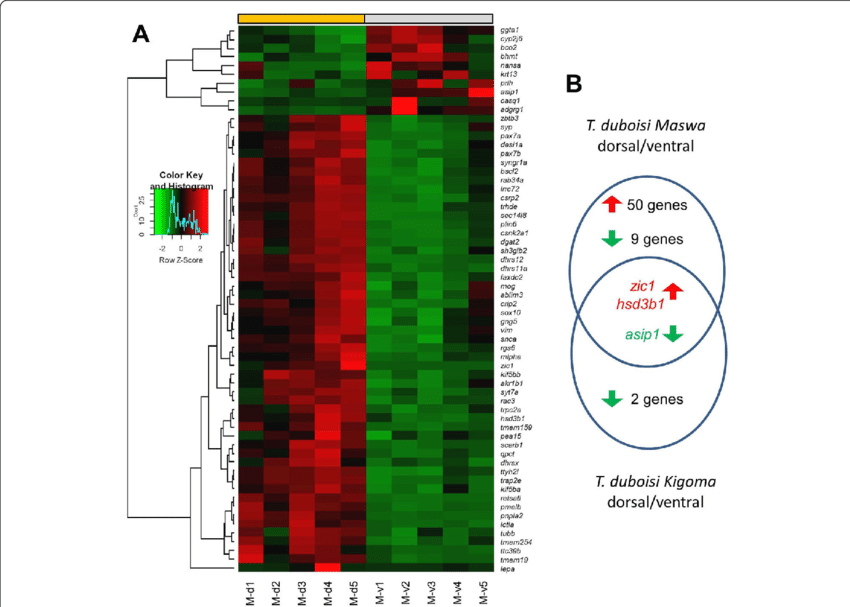

```{r setup, include=FALSE}
knitr::opts_chunk$set(echo = TRUE, eval = FALSE, warning = FALSE, message = FALSE)
```

# Introduction

This project contains a workflow for examining the effect of ocean acidification on gene expression of snow crabs. It runs using paired end RNA-Seq data prepared and provided by Laura Spencer. 63 juvenile crabs were exposed to the following pH treatments:

-   control (ambient)
-   pH 7.8 (8 hours)
-   pH 7.8 (12 weeks)
-   pH 7.5 (8 hours)
-   pH 7.5 (12 weeks)

On 7/20/2021, after exposure, all crabs were sacrificed by puncturing the carapace through the cardiac region. Crabs were preserved overnight at 4C prior to being transferred to -80C. mRNA samples were then extracted. Each of the 63 mRNA samples were run in both lanes of NovaSeq 6000, for a grand total of 126 paired-end RNA-Seq data sets. Sequence data received January 3, 2022.

[{width="592"}](https://bmcgenomics.biomedcentral.com/articles/10.1186/s12864-020-6473-8)

## Links:

-   [Rmd file](https://github.com/course-fish546-2023/courtney_RNAseq_crabs/blob/970eec8fea6298725a453ccc06ac890338e26598/code/snowcrabs_dge.Rmd)
-   [Output on github](https://github.com/course-fish546-2023/courtney_RNAseq_crabs/tree/main/output)

## Data

The data is located [here](https://drive.google.com/drive/u/1/folders/1w7tqjcd-Rabh0TsWpw-JLTcJ2QbWIh3H), uploaded by LS on 01/12/2022.

Detailed metadata is located [here](https://docs.google.com/document/d/1HzMTreqnY2BD-oyjEJRA-JECpFE4CXlEoWKkmiaTYis/edit#).

# Code

## Look at all RNASeq files

```{bash}
#there are 63 files within /5010 
ls /home/shared/8TB_HDD_01/snow_crab/5010
```

## Download C. bairdi reference, save it to "data" directory

```{bash}
cd ../data
curl -O https://owl.fish.washington.edu/halfshell/genomic-databank/cbai_genome_v1.0.fasta
```

## Set index

```{bash}
#index "cbai_genome_v1.0.fasta" and rename it as "cbai_genome_v1.0.index"
/home/shared/kallisto/kallisto \
index -i \
../data/cbai_genome_v1.0.index \  
../data/cbai_genome_v1.0.fasta
```

## Look at files within folder 5010

```{bash}
#list file names
ls /home/shared/8TB_HDD_01/snow_crab/5010/*fastq.gz
```

## Create abundance estimates

```{bash}
#make a new directory in output
mkdir ../output/kallisto_paired

#find specific files and create abundance estimates
find /home/shared/8TB_HDD_01/snow_crab/5010/*fastq.gz \
| xargs basename -s _L003_R1_001.fastq.gz | xargs -I{} \
/home/shared/kallisto/kallisto \
quant -i ../data/cbai_genome_v1.0.index \
-o ../output/kallisto_paired/{} \
-t 40 \
/home/shared/8TB_HDD_01/snow_crab/5010/{}_L003_R1_001.fastq.gz \
/home/shared/8TB_HDD_01/snow_crab/5010/{}_L003_R2_001.fastq.gz

# delete empty files
rm ../output/kallisto_paired/*R2_001.fastq.gz
```

## Create a gene expression matrix from kallisto output files

Run abundance_estimates_to_matrix.pl script from the Trinity RNA-seq assembly software package.

```{bash}
ls ~/courtney_RNAseq_crabs/output/kallisto_paired
#use these folder names for perl input
```

```{bash}
#Sample name input for perl
perl /home/shared/trinityrnaseq-v2.12.0/util/abundance_estimates_to_matrix.pl \
--est_method kallisto \
    --gene_trans_map none \
    --out_prefix ../output/kallisto_paired \
    --name_sample_by_basedir \
    ../output/kallisto_paired/5010_1_S1/abundance.tsv \
    ../output/kallisto_paired/5010_2_S2/abundance.tsv \
    ../output/kallisto_paired/5010_3_S3/abundance.tsv \
    ../output/kallisto_paired/5010_4_S4/abundance.tsv \
    ../output/kallisto_paired/5010_5_S5/abundance.tsv \
    ../output/kallisto_paired/5010_6_S6/abundance.tsv \
    ../output/kallisto_paired/5010_7_S7/abundance.tsv \
    ../output/kallisto_paired/5010_8_S8/abundance.tsv \
    ../output/kallisto_paired/5010_9_S9/abundance.tsv \
    ../output/kallisto_paired/5010_10_S10/abundance.tsv \
    ../output/kallisto_paired/5010_11_S11/abundance.tsv \
    ../output/kallisto_paired/5010_12_S12/abundance.tsv \
    ../output/kallisto_paired/5010_13_S13/abundance.tsv \
    ../output/kallisto_paired/5010_14_S14/abundance.tsv \
    ../output/kallisto_paired/5010_15_S15/abundance.tsv \
    ../output/kallisto_paired/5010_16_S16/abundance.tsv \
    ../output/kallisto_paired/5010_17_S17/abundance.tsv \
    ../output/kallisto_paired/5010_18_S18/abundance.tsv \
    ../output/kallisto_paired/5010_19_S19/abundance.tsv \
    ../output/kallisto_paired/5010_20_S20/abundance.tsv \
    ../output/kallisto_paired/5010_21_S21/abundance.tsv \
    ../output/kallisto_paired/5010_22_S22/abundance.tsv \
    ../output/kallisto_paired/5010_23_S23/abundance.tsv \
    ../output/kallisto_paired/5010_24_S24/abundance.tsv \
    ../output/kallisto_paired/5010_25_S25/abundance.tsv \
    ../output/kallisto_paired/5010_26_S26/abundance.tsv \
    ../output/kallisto_paired/5010_27_S27/abundance.tsv \
    ../output/kallisto_paired/5010_28_S28/abundance.tsv \
    ../output/kallisto_paired/5010_29_S29/abundance.tsv \
    ../output/kallisto_paired/5010_30_S30/abundance.tsv \
    ../output/kallisto_paired/5010_31_S31/abundance.tsv \
    ../output/kallisto_paired/5010_32_S32/abundance.tsv \
    ../output/kallisto_paired/5010_33_S33/abundance.tsv \
    ../output/kallisto_paired/5010_34_S34/abundance.tsv \
    ../output/kallisto_paired/5010_35_S35/abundance.tsv \
    ../output/kallisto_paired/5010_36_S36/abundance.tsv \
    ../output/kallisto_paired/5010_37_S37/abundance.tsv \
    ../output/kallisto_paired/5010_38_S38/abundance.tsv \
    ../output/kallisto_paired/5010_39_S39/abundance.tsv \
    ../output/kallisto_paired/5010_40_S40/abundance.tsv \
    ../output/kallisto_paired/5010_41_S41/abundance.tsv \
    ../output/kallisto_paired/5010_42_S42/abundance.tsv \
    ../output/kallisto_paired/5010_43_S43/abundance.tsv \
    ../output/kallisto_paired/5010_44_S44/abundance.tsv \
    ../output/kallisto_paired/5010_45_S45/abundance.tsv \
    ../output/kallisto_paired/5010_46_S46/abundance.tsv \
    ../output/kallisto_paired/5010_47_S47/abundance.tsv \
    ../output/kallisto_paired/5010_48_S48/abundance.tsv \
    ../output/kallisto_paired/5010_49_S49/abundance.tsv \
    ../output/kallisto_paired/5010_50_S50/abundance.tsv \
    ../output/kallisto_paired/5010_51_S51/abundance.tsv \
    ../output/kallisto_paired/5010_52_S52/abundance.tsv \
    ../output/kallisto_paired/5010_53_S53/abundance.tsv \
    ../output/kallisto_paired/5010_54_S54/abundance.tsv \
    ../output/kallisto_paired/5010_55_S55/abundance.tsv \
    ../output/kallisto_paired/5010_56_S56/abundance.tsv \
    ../output/kallisto_paired/5010_57_S57/abundance.tsv \
    ../output/kallisto_paired/5010_58_S58/abundance.tsv \
    ../output/kallisto_paired/5010_59_S59/abundance.tsv \
    ../output/kallisto_paired/5010_60_S60/abundance.tsv \
    ../output/kallisto_paired/5010_61_S61/abundance.tsv \
    ../output/kallisto_paired/5010_62_S62/abundance.tsv \
    ../output/kallisto_paired/5010_63_S63/abundance.tsv

```

## Get packages

```{r, eval = TRUE, echo = FALSE}
library(DESeq2)
library(tidyverse)
library(pheatmap)
library(RColorBrewer)
library(data.table)
```

## Read in count matrix

```{r, , eval = TRUE}
countmatrix <- read.delim("../output/kallisto_paired.isoform.counts.matrix", header = TRUE, sep = '\t')
rownames(countmatrix) <- countmatrix$X
countmatrix <- countmatrix[,-1]
head(countmatrix)
```

### Round up to whole numbers

```{r, eval = TRUE, echo = FALSE}
countmatrix <- round(countmatrix, 0)
str(countmatrix)
```

## Get differential gene expression based on pH exposure

```{r, , eval = TRUE, echo = FALSE}
deseq2.colData <- data.frame(condition=factor(c(rep("control", 12), rep("pH 7.5-long exposure", 14), rep("pH 7.5-short exposure", 12), rep("pH 7.8-long exposure", 14), rep("pH 7.8-short exposure", 11))), 
                             type=factor(rep("paired-end", 63)))
rownames(deseq2.colData) <- colnames(data)
deseq2.dds <- DESeqDataSetFromMatrix(countData = countmatrix,
                                     colData = deseq2.colData, 
                                     design = ~ condition)
dim(countmatrix)
dim(deseq2.colData)
deseq2.colData
deseq2.dds
```

```{r, eval = TRUE, echo = FALSE, warning = FALSE}
deseq2.dds <- DESeq(deseq2.dds)
deseq2.res <- results(deseq2.dds)
deseq2.res <- deseq2.res[order(rownames(deseq2.res)), ]
```

## Look at DESeq matrix

```{r, eval = TRUE}
head(deseq2.res)
```

## Look for signficant values

```{r, eval = TRUE}
# Count number of hits with adjusted p-value less then 0.05
dim(deseq2.res[!is.na(deseq2.res$padj) & deseq2.res$padj <= 0.05, ])
```

```{r, eval = TRUE}
tmp <- deseq2.res
# The main plot
plot(tmp$baseMean, tmp$log2FoldChange, pch=20, cex=0.45, ylim=c(-3, 3), log="x", col="darkgray",
     main="DEG Snow Crab Treatments  (pval <= 0.05)",
     xlab="mean of normalized counts",
     ylab="Log2 Fold Change")
# Getting the significant points and plotting them again so they're a different color
tmp.sig <- deseq2.res[!is.na(deseq2.res$padj) & deseq2.res$padj <= 0.05, ]
points(tmp.sig$baseMean, tmp.sig$log2FoldChange, pch=20, cex=0.45, col="red")
# 2 FC lines
abline(h=c(-1,1), col="blue")
```

```{r, eval = TRUE}
write.table(tmp.sig, "../output/DEGlist.tab", row.names = T)
```
